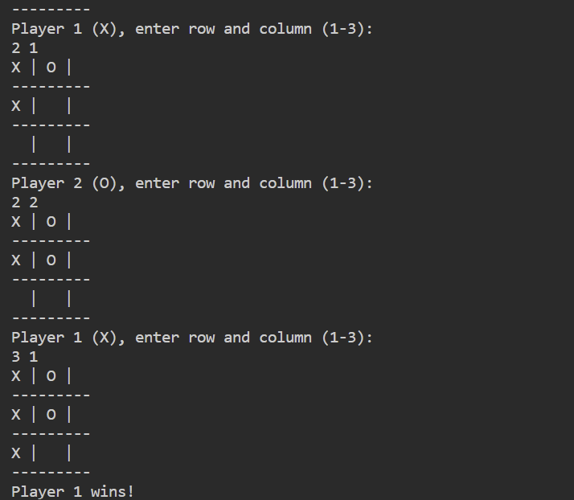

# ruby_Tic-Tac-Toe
This repo is part of the `Odin` Project Challenges.

Tic-Tac-Toe Game in Ruby

This project is a simple implementation of the classic Tic-Tac-Toe game in Ruby. It allows two human players to play the game in the command line.

Installation
Clone the repository or download the source code.
Navigate to the directory containing the game files.
Running the Game
To start the game, run the following command in your terminal:

bash

`ruby tictactoe_mono.rb`
Follow the on-screen prompts to play the game. Each player will be asked to enter the row and column numbers to place their symbol (X or O) on the board.

Game Rules

The game is played on a 3x3 grid.

Players take turns to place their symbol (X or O) in an empty cell.

The first player to get 3 of their symbols in a row (up, down, across, or diagonally) wins the game.
If all 9 cells are filled and no player has 3 symbols in a row, the game is a draw.

Running Tests
This project uses RSpec for testing. Ensure you have RSpec installed. If not, you can install it by running:

bash

`gem install rspec`
To run the tests, navigate to the project directory and execute:

bash

`rspec`
This will run all the tests and display the results in your terminal.